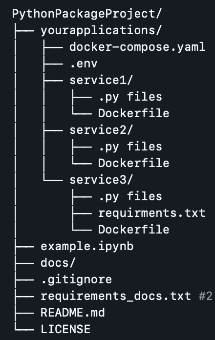

## **Project Focus:** Customer Retention & CLV Optimization for Gyms

--- 

## **Authors**

- Project/Product Manager - Artsvik Avetisyan
- Database Developer - Levon Titanyan
- Back-end Developer - Armen Ghazaryan
- Frond-end Developer - Ani Gharibyan
- Data Analyst/Scientist - Manuk Manukyan

---

The problem area lies in **Customer Retention** and **Customer Lifetime Value optimization** in the fitness industry.

Many gyms lack proactive systems to detect disengaged members and intervene before they churn.  
Extended periods of absence not only signal a higher risk of churn but can also lead to **customer demotivation**, decreased engagement, and weakened **brand loyalty**.  

---

## Installation

Ensure you have the following prerequisites installed:

1. Clone the repository:

```bash
git clone https://github.com/DS-223/Group-3.git
cd Group-3
```

2. Build and start the Docker containers:

```bash
docker-compose up --build
```

## Project Structure



## ER Diagram


---

After running docker-compose up --build, open your browser and go to:
👉 http://localhost:8501
Dummy login:
email: admin@gym.com
Password: 1234