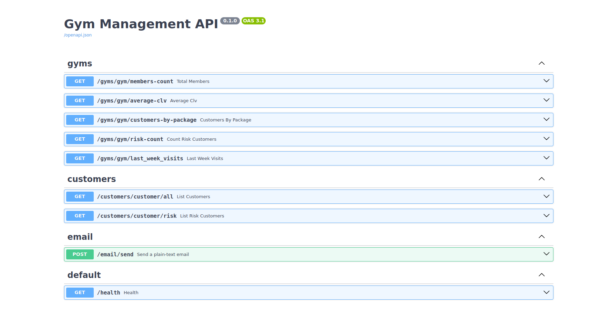
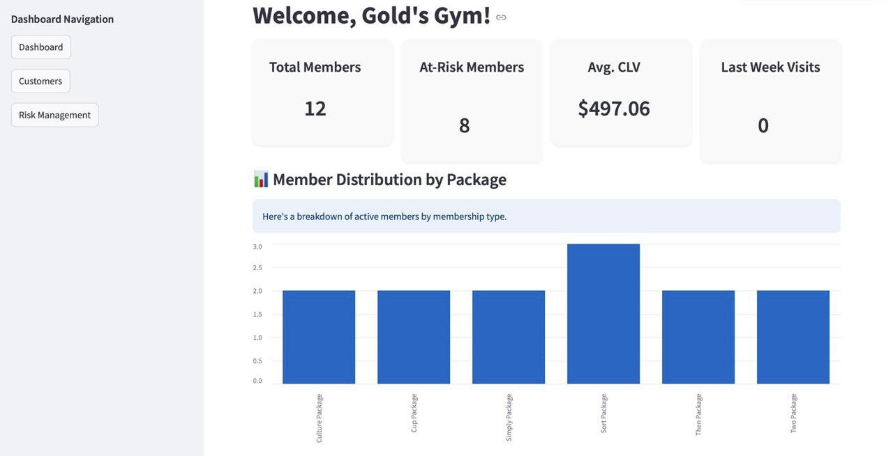
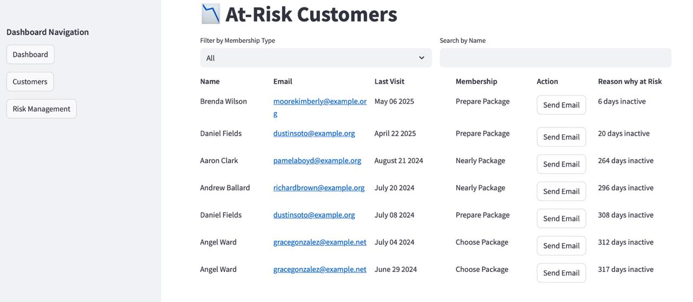
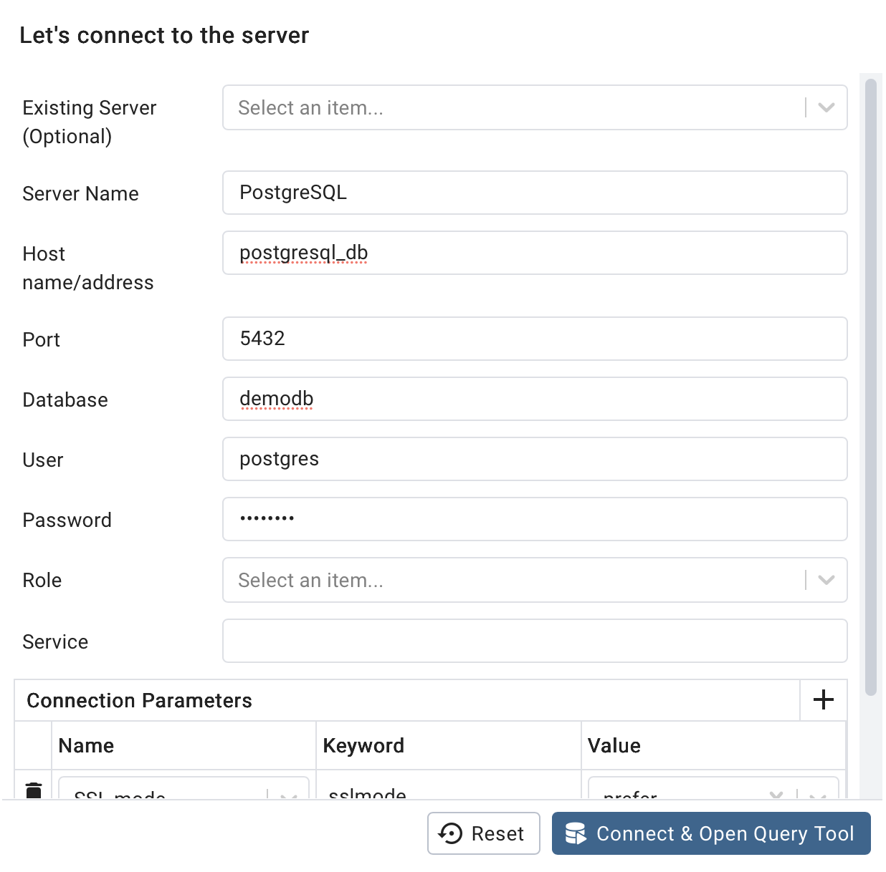

# 📘 Project Focus: Customer Retention & CLV Optimization for Gyms

This project aims to empower gyms to track attendance, identify at-risk customers, and re-engage them via targeted email campaigns. Each gym logs in to their dedicated dashboard to monitor member insights like risk level and lifetime value.

---

## 👤 Authors

- **Project/Product Manager**: Artsvik Avetisyan
- **Database Developer**: Levon Titanyan
- **Back-end Developer**: Armen Ghazaryan
- **Front-end Developer**: Ani Gharibyan
- **Data Analyst/Scientist**: Manuk Manukyan

---

## 🛠 Installation

Make sure you have Docker and Docker Compose installed on your system.

```bash
git clone https://github.com/DS-223/Group-3.git
cd Group-3
docker-compose up --build
```

---

## 🖥️ Access the Application

Once Docker is running:

- **Streamlit Frontend**: [http://localhost:8501](http://localhost:8501) 
- **FastAPI Docs (Swagger)**: [http://localhost:8000/docs](http://localhost:8000/docs)
- **PgAdmin**: [http://localhost:5050](http://localhost:5050)  
  - Email: admin@admin.com
  - Password: admin

---

## 💾 Environment Variables (.env)

```env
DATABASE_URL=postgresql+psycopg2://postgres:password@db:5432/demodb
DB_USER=postgres
DB_PASSWORD=password
DB_NAME=demodb
PGADMIN_EMAIL=admin@admin.com
PGADMIN_PASSWORD=admin
SECRET_KEY=secret-key
```

---

## 📂 Project Structure

```bash
├── .github/workflows/             
│   └── ci.yaml
│
├── docs/                         
│   ├── api.md
│   ├── database.md
│   ├── frontend.md
│   ├── index.md
│   └── models.md                  
│
├── images/                 
│   ├── At-risk_Customers.jpeg
│   ├── Dashboard.jpeg
│   ├── ERD.jpg
│   └── Swagger.png
│   └── PGadmin_detup.png
│
├── myapplications/                
│   ├── api/                      
│   ├── ds/                       
│   ├── etl/                       
│   └── frontend/                 
│
├── .env                          
├── .gitkeep                       
├── docker-compose.yml            
├── requirements.txt              
├── mkdocs_requirements.txt      
├── mkdocs.yml                   
├── LICENSE
├── README.md                    
├── example.ipynb                      
```

---

## 🧠 Features

### ✅ Frontend (Streamlit)
- Visual Dashboard: Total members, at-risk members, average CLV
- Member distribution by package (bar chart)
- Filterable Customer List
- At-Risk Customer View with Email Sender

### ✅ Backend (FastAPI)
- `GET /gyms/gym/members-count` — Total members
- `GET /gyms/gym/average-clv` — Avg. CLV
- `GET /gyms/gym/customers-by-package` — Member distribution by package
- `GET /customers/customer/risk` — At-risk customers
- `POST /email/send` — Send email to customers
...

---

## 🧪 API Swagger Documentation

Available after running: [http://localhost:8000/docs](http://localhost:8000/docs)



---

## 📊 Dashboard UI Screenshots




---

## 🗄️ pgAdmin Setup

Login → Add new server → Enter name → Under connection:
- Host: `db`
- User: `postgres`
- Password: `password`



---

## 🧪 ETL Pipeline (Python)
- Reads CSVs from `etl/data/`
- Computes RFM + CLV using attendance and transactions
- Segments users via KMeans
- Inserts final tables into PostgreSQL

---

## 🧱 Database Model

See `images/ERD.jpg` for the Entity Relationship Diagram.

Tables: `customers`, `transactions`, `attendance`, `packages`, `gyms`, `rfm`, `clv`

---

## 📘 Documentation (MkDocs)

To serve locally:
```bash
pip install mkdocs-material mkdocstrings[python] pillow cairosvg
mkdocs serve
```
To deploy:
```bash
mkdocs gh-deploy --force
```

---

## 📌 Technologies

- **Backend**: FastAPI + SQLAlchemy
- **Frontend**: Streamlit
- **Database**: PostgreSQL + pgAdmin
- **ML/DS**: RFM, CLV, KMeans Clustering
- **Dockerized**: Yes (with Compose)
- **Documentation**: MkDocs + GitHub Actions

---

## 🔗 Links

- 💻 Streamlit UI: http://localhost:8501
- 🔐 Swagger UI: http://localhost:8000/docs
- 🛢️ PgAdmin: http://localhost:5050

---